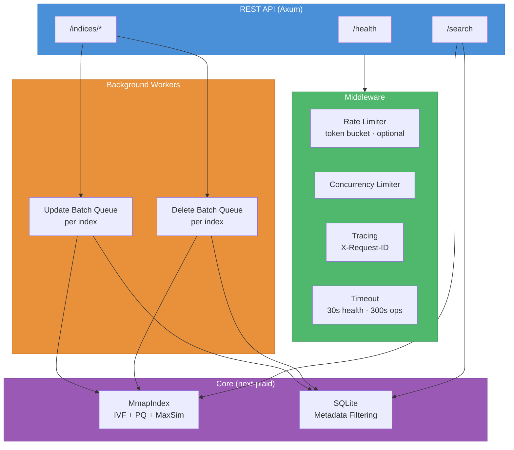
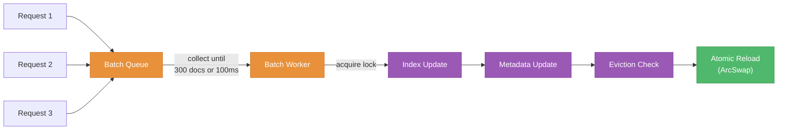

<div align="center">
  <h1>NextPlaid API</h1>
  <p>A REST API for multi-vector search.<br/>
  Async batching, metadata filtering, optional rate limiting, Swagger UI.</p>

  <p>
    <a href="#quick-start"><b>Quick Start</b></a>
    &middot;
    <a href="#api-reference"><b>API Reference</b></a>
    &middot;
    <a href="#python-sdk"><b>Python SDK</b></a>
    &middot;
    <a href="#docker"><b>Docker</b></a>
    &middot;
    <a href="#architecture"><b>Architecture</b></a>
  </p>
</div>

---

## Quick Start

**Run with Docker (recommended):**

```bash
docker run -p 8080:8080 -v ~/.local/share/next-plaid:/data/indices \
  ghcr.io/lightonai/next-plaid:cpu-1.0.6 \
  --host 0.0.0.0 --port 8080 --index-dir /data/indices
```

**Use from Python:**

```bash
pip install next-plaid-client
```

```python
from next_plaid_client import NextPlaidClient, IndexConfig

client = NextPlaidClient("http://localhost:8080")

# Create index and add documents (you provide embeddings)
client.create_index("docs", IndexConfig(nbits=4))
client.add("docs",
    documents=[embeddings_1, embeddings_2],
    metadata=[{"id": "doc_1"}, {"id": "doc_2"}],
)

# Search
results = client.search("docs", [query_embedding])

# Search with metadata filtering
results = client.search("docs", [query_embedding],
    filter_condition="id = ?", filter_parameters=["doc_1"],
)

# Delete by predicate
client.delete("docs", "id = ?", ["doc_1"])
```

**Or call the API directly:**

```bash
# Create index
curl -X POST http://localhost:8080/indices \
  -H 'Content-Type: application/json' \
  -d '{"name": "docs", "config": {"nbits": 4}}'

# Add documents with pre-computed embeddings
curl -X POST http://localhost:8080/indices/docs/update \
  -H 'Content-Type: application/json' \
  -d '{"documents": [{"embeddings": [[0.1, 0.2, 0.3]]}], "metadata": [{"title": "test"}]}'

# Search
curl -X POST http://localhost:8080/indices/docs/search \
  -H 'Content-Type: application/json' \
  -d '{"queries": [{"embeddings": [[0.1, 0.2, 0.3]]}], "params": {"top_k": 5}}'
```

Interactive docs at [http://localhost:8080/swagger-ui](http://localhost:8080/swagger-ui).

---

## API Reference

### Health & Documentation

| Method | Path                     | Description                                           |
| ------ | ------------------------ | ----------------------------------------------------- |
| `GET`  | `/health`                | Health check with system info and all index summaries |
| `GET`  | `/`                      | Alias for `/health`                                   |
| `GET`  | `/swagger-ui`            | Interactive Swagger UI                                |
| `GET`  | `/api-docs/openapi.json` | OpenAPI 3.0 specification                             |

### Index Management

| Method   | Path                     | Description                                  |
| -------- | ------------------------ | -------------------------------------------- |
| `GET`    | `/indices`               | List all indices                             |
| `POST`   | `/indices`               | Declare a new index (config only, no data)   |
| `GET`    | `/indices/{name}`        | Get index info (docs, partitions, dimension) |
| `DELETE` | `/indices/{name}`        | Delete an index and all its data             |
| `PUT`    | `/indices/{name}/config` | Update config (e.g. `max_documents`)         |

### Documents

| Method   | Path                        | Returns     | Description                                                                            |
| -------- | --------------------------- | ----------- | -------------------------------------------------------------------------------------- |
| `POST`   | `/indices/{name}/update`    | `202`/`200` | Add documents with pre-computed embeddings. Pass `?wait=true` to block until indexed.  |
| `POST`   | `/indices/{name}/documents` | `202`       | Add to existing index (legacy)                                                         |
| `DELETE` | `/indices/{name}/documents` | `202`       | Delete by SQL WHERE condition                                                          |

All document mutations return `202 Accepted` and process asynchronously. Concurrent requests to the same index are batched automatically. Use `?wait=true` on `/update` when you need synchronous confirmation that documents are indexed and searchable.

### Search

| Method | Path                              | Description                  |
| ------ | --------------------------------- | ---------------------------- |
| `POST` | `/indices/{name}/search`          | Search with embedding arrays |
| `POST` | `/indices/{name}/search/filtered` | Search + SQL metadata filter |

### Metadata

| Method | Path                              | Description                             |
| ------ | --------------------------------- | --------------------------------------- |
| `GET`  | `/indices/{name}/metadata`        | Get all metadata entries                |
| `GET`  | `/indices/{name}/metadata/count`  | Count metadata entries                  |
| `POST` | `/indices/{name}/metadata/check`  | Check which doc IDs have metadata       |
| `POST` | `/indices/{name}/metadata/query`  | Get doc IDs matching SQL condition      |
| `POST` | `/indices/{name}/metadata/get`    | Get metadata by IDs or SQL condition    |
| `POST` | `/indices/{name}/metadata/update` | Update metadata rows matching condition |

---

## Request & Response Examples

### Create Index

```bash
POST /indices
```

```json
{
  "name": "my_index",
  "config": {
    "nbits": 4,
    "batch_size": 50000,
    "seed": 42,
    "start_from_scratch": 999,
    "max_documents": 10000
  }
}
```

| Field                | Default | Description                                   |
| -------------------- | ------- | --------------------------------------------- |
| `nbits`              | `4`     | Quantization bits (2 or 4)                    |
| `batch_size`         | `50000` | Documents per indexing chunk                  |
| `seed`               | `null`  | Random seed for K-means                       |
| `start_from_scratch` | `999`   | Below this doc count, full rebuild on update  |
| `max_documents`      | `null`  | Evict oldest when exceeded (null = unlimited) |

### Add Documents

```bash
POST /indices/my_index/update
POST /indices/my_index/update?wait=true   # block until searchable
```

```json
{
  "documents": [
    {
      "embeddings": [
        [0.1, 0.2, 0.3],
        [0.4, 0.5, 0.6]
      ]
    },
    {
      "embeddings": [
        [0.7, 0.8, 0.9],
        [0.1, 0.2, 0.3]
      ]
    }
  ],
  "metadata": [{ "title": "Doc A" }, { "title": "Doc B" }]
}
```

### Search

```bash
POST /indices/my_index/search
```

```json
{
  "queries": [{"embeddings": [[0.1, 0.2, 0.3]]}],
  "params": { "top_k": 10 }
}
```

**Response:**

```json
{
  "results": [
    {
      "query_id": 0,
      "document_ids": [0, 1],
      "scores": [18.42, 12.67],
      "metadata": [{ "title": "Doc A" }, { "title": "Doc B" }]
    }
  ],
  "num_queries": 1
}
```

### Search with Filter

```bash
POST /indices/my_index/search/filtered
```

```json
{
  "queries": [{"embeddings": [[0.1, 0.2, 0.3]]}],
  "params": { "top_k": 5 },
  "filter_condition": "country = ?",
  "filter_parameters": ["France"]
}
```

### Search Parameters

| Parameter                  | Default | Description                              |
| -------------------------- | ------- | ---------------------------------------- |
| `top_k`                    | `10`    | Results to return per query              |
| `n_ivf_probe`              | `8`     | IVF cells to probe per query token       |
| `n_full_scores`            | `4096`  | Candidates for exact re-ranking          |
| `centroid_score_threshold` | `null`  | Prune low-scoring centroids (e.g. `0.4`) |

### Delete Documents

```bash
DELETE /indices/my_index/documents
```

```json
{
  "condition": "country = ? AND year < ?",
  "parameters": ["outdated", 2020]
}
```

Returns `202 Accepted`. Deletes are batched: multiple delete requests within a short window are processed together.

### Health

```bash
GET /health
```

```json
{
  "status": "healthy",
  "version": "1.0.1",
  "loaded_indices": 1,
  "index_dir": "/data/indices",
  "memory_usage_bytes": 104857600,
  "indices": [
    {
      "name": "my_index",
      "num_documents": 1000,
      "num_embeddings": 50000,
      "num_partitions": 512,
      "dimension": 128,
      "nbits": 4,
      "avg_doclen": 50.0,
      "has_metadata": true
    }
  ]
}
```

---

## Error Codes

All errors return JSON:

```json
{
  "code": "ERROR_CODE",
  "message": "Human-readable description",
  "details": null
}
```

| Code                   | HTTP | When                                                              |
| ---------------------- | ---- | ----------------------------------------------------------------- |
| `INDEX_NOT_FOUND`      | 404  | Index does not exist                                              |
| `INDEX_ALREADY_EXISTS` | 409  | Index name already taken                                          |
| `INDEX_NOT_DECLARED`   | 404  | Must `POST /indices` before updating                              |
| `BAD_REQUEST`          | 400  | Invalid parameters                                                |
| `DIMENSION_MISMATCH`   | 400  | Embedding dim doesn't match index                                 |
| `METADATA_NOT_FOUND`   | 404  | No metadata database for this index                               |
| `SERVICE_UNAVAILABLE`  | 503  | Queue full, retry later                                           |
| `RATE_LIMITED`         | 429  | Too many requests, requires `RATE_LIMIT_ENABLED` (retry after 2s) |
| `INTERNAL_ERROR`       | 500  | Unexpected server error                                           |

---

## Python SDK

```bash
pip install next-plaid-client
```

Both sync and async clients:

```python
from next_plaid_client import NextPlaidClient, AsyncNextPlaidClient
from next_plaid_client import IndexConfig, SearchParams

# Sync
client = NextPlaidClient("http://localhost:8080")

# Async
client = AsyncNextPlaidClient("http://localhost:8080")
await client.search("docs", [query_embedding])
```

### SDK Methods

| Method                                                                      | Description      |
| --------------------------------------------------------------------------- | ---------------- |
| `client.health()`                                                           | Health check     |
| `client.create_index(name, config)`                                         | Create index     |
| `client.delete_index(name)`                                                 | Delete index     |
| `client.get_index(name)`                                                    | Get index info   |
| `client.list_indices()`                                                     | List all indices |
| `client.add(name, documents, metadata)`                                     | Add documents    |
| `client.search(name, queries, params, filter_condition, filter_parameters)` | Search           |
| `client.delete(name, condition, parameters)`                                | Delete by filter |

---

## Docker

### Image

```bash
docker pull ghcr.io/lightonai/next-plaid:cpu-1.0.6
```

### Docker Compose

```yaml
services:
  next-plaid-api:
    image: ghcr.io/lightonai/next-plaid:cpu-1.0.6
    ports:
      - "8080:8080"
    volumes:
      - ${NEXT_PLAID_DATA:-~/.local/share/next-plaid}:/data/indices
    environment:
      - RUST_LOG=info
    command:
      - --host
      - "0.0.0.0"
      - --port
      - "8080"
      - --index-dir
      - /data/indices
    healthcheck:
      test: ["CMD", "curl", "-f", "--max-time", "5", "http://localhost:8080/health"]
      interval: 15s
      timeout: 5s
      retries: 2
      start_period: 30s
    restart: unless-stopped
    deploy:
      resources:
        limits:
          memory: 16G
```

### Volume Mounts

| Host Path                   | Container Path  | Purpose                  |
| --------------------------- | --------------- | ------------------------ |
| `~/.local/share/next-plaid` | `/data/indices` | Persistent index storage |

---

## CLI Reference

```
next-plaid-api [OPTIONS]
```

| Flag              | Default     | Description             |
| ----------------- | ----------- | ----------------------- |
| `-h, --host`      | `0.0.0.0`   | Bind address            |
| `-p, --port`      | `8080`      | Bind port               |
| `-d, --index-dir` | `./indices` | Index storage directory |

```bash
# Run
next-plaid-api -p 8080 -d /data/indices

# Debug logging
RUST_LOG=debug next-plaid-api -d /data/indices
```

---

## Architecture



### Concurrency Design

The API uses **lock-free reads** and **batched writes** for high throughput:

- **Reads (search, metadata queries):** Lock-free via `ArcSwap`. Readers never block, even during writes.
- **Index updates:** Per-index batch queue collects requests, processes up to 300 documents (or 100ms timeout) in a single atomic operation. Pass `?wait=true` to block until the batch is fully indexed and searchable.
- **Deletes:** Per-index delete queue batches conditions, resolves IDs inside the lock to handle ID shifting correctly.
- **Auto-repair:** Before every update/delete, the API checks if the vector index and SQLite metadata are in sync. If not, it repairs automatically.



### Rate Limiting

Rate limiting is **optional and disabled by default**. Enable it by setting `RATE_LIMIT_ENABLED=true`.

| Scope                                                        | Rate limited? | Why exempt                           |
| ------------------------------------------------------------ | ------------- | ------------------------------------ |
| `/health`, `/`                                               | No            | Monitoring must always work          |
| `GET /indices`, `GET /indices/{name}`                        | No            | Clients poll during async operations |
| `POST /indices/{name}/update*`                               | No            | Has per-index semaphore protection   |
| `DELETE /indices/{name}`, `DELETE /indices/{name}/documents` | No            | Has internal batching                |
| Everything else                                              | Yes           | Standard rate limiting               |

---

## Environment Variables

### Rate Limiting & Concurrency

| Variable                | Default | Description                                            |
| ----------------------- | ------- | ------------------------------------------------------ |
| `RATE_LIMIT_ENABLED`    | `false` | Enable rate limiting (`true`, `1`, or `yes` to enable) |
| `RATE_LIMIT_PER_SECOND` | `50`    | Sustained requests/second (when enabled)               |
| `RATE_LIMIT_BURST_SIZE` | `100`   | Max burst size (when enabled)                          |
| `CONCURRENCY_LIMIT`     | `100`   | Max concurrent in-flight requests                      |

### Document Batching

| Variable                     | Default | Description                                   |
| ---------------------------- | ------- | --------------------------------------------- |
| `MAX_QUEUED_TASKS_PER_INDEX` | `10`    | Max pending updates per index (503 when full) |
| `MAX_BATCH_DOCUMENTS`        | `300`   | Documents per batch before processing         |
| `BATCH_CHANNEL_SIZE`         | `100`   | Buffer for document batch queue               |

### Delete Batching

| Variable                      | Default | Description                                        |
| ----------------------------- | ------- | -------------------------------------------------- |
| `DELETE_BATCH_MIN_WAIT`       | `500`   | Min wait (ms) after first delete before processing |
| `DELETE_BATCH_MAX_WAIT`       | `2000`  | Max wait (ms) for accumulating deletes             |
| `MAX_DELETE_BATCH_CONDITIONS` | `200`   | Max conditions per delete batch                    |

### Logging

| Variable   | Default | Description                                  |
| ---------- | ------- | -------------------------------------------- |
| `RUST_LOG` | `info`  | Log level (`debug`, `info`, `warn`, `error`) |

---

## Feature Flags

| Feature      | Description                            |
| ------------ | -------------------------------------- |
| _(default)_  | Core API, no BLAS                      |
| `openblas`   | OpenBLAS for matrix operations (Linux) |
| `accelerate` | Apple Accelerate (macOS)               |

```bash
# Default
cargo build --release -p next-plaid-api

# With OpenBLAS (Linux)
cargo build --release -p next-plaid-api --features openblas
```

---

## Modules

| Module               | Description                                                         |
| -------------------- | ------------------------------------------------------------------- |
| `handlers/documents` | Index CRUD, update batching, delete batching, eviction, auto-repair |
| `models`             | All request/response JSON schemas with OpenAPI annotations          |
| `state`              | `AppState`, `IndexSlot` (ArcSwap), config caching                   |
| `handlers/search`    | Search + filtered search, metadata enrichment                       |
| `handlers/metadata`  | Metadata CRUD: check, query, get, count, update                     |
| `error`              | Error types with HTTP status code mapping                           |
| `tracing_middleware` | Request tracing via `X-Request-ID` header                           |
| `main`               | CLI argument parsing, router construction, Swagger UI, startup      |
| `lib`                | `PrettyJson` response type, module re-exports                       |

---

## Dependencies

| Crate                          | Purpose                                          |
| ------------------------------ | ------------------------------------------------ |
| `next-plaid`                   | Core PLAID index (IVF + PQ + MaxSim)             |
| `axum` 0.8                     | Web framework                                    |
| `tokio`                        | Async runtime                                    |
| `tower` / `tower-http`         | Middleware (CORS, tracing, timeout, concurrency) |
| `tower_governor`               | Rate limiting (token bucket)                     |
| `utoipa` / `utoipa-swagger-ui` | OpenAPI generation + Swagger UI                  |
| `arc-swap`                     | Lock-free index swapping                         |
| `parking_lot`                  | Fast read-write locks                            |
| `sysinfo`                      | Process memory usage for `/health`               |
| `uuid`                         | Request trace IDs                                |
| `ndarray`                      | N-dimensional arrays                             |
| `serde` / `serde_json`         | Serialization                                    |

---

## License

Apache-2.0